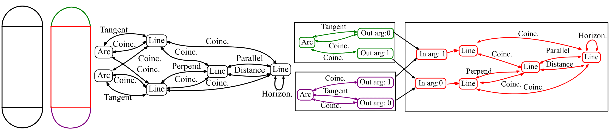

# Discovering Design Concepts for CAD Sketches 

This repository contains the core implementation of our paper:

**[Discovering Design Concepts for CAD Sketches](NeurIPS 2022)**
<br>
Yuezhi Yang,
Hao Pan
<br>
<br>




## Installation
Following is the suggested way to install the dependencies of our code:
```
git clone --recursive https://github.com/yyuezhi/SketchConcept.git

cd SketchConcept

conda create  -n sketch_concept python=3.8

conda activate sketch_concept

conda install pytorch==1.13.1 lz4 pytorch-cuda=11.6 matplotlib=3.7.1 -c pytorch -c nvidia

pip install -e SketchGraphs

pip install tensorboard scipy networkx numpy==1.23.4
```
## Data Preparation
We provide preprocessed SketchGraph dataset and corresponding index file which filters the sketches we used to train the model. Please download the pretrained models from [Google Drive](https://drive.google.com/drive/folders/1xy9VVN5-XqLTJ-uYZ2nj_vr_mSDQWSS6?usp=share_link) and put them in `Data/`. For file size issue, the data are splited into two patches of roughly equal size.


## Pre-trained Models
We provide the pretrained models for design intent interpretation. Please download the pretrained models from [Google Drive](https://drive.google.com/drive/folders/1O5f3P1hnhkwqp_lCDbHE9QiphANWmfyQ?usp=share_link) and put them in `experiment_directory/sample_pretrain_exp/result/network_param`.

## Usage
### Train from Scratch
```
python train.py -d ./Data/ -e experiment_directory/sample_exp  --train_file sketch1_randnorm_sorted.npy
```

### Generate sketch result for visualization using pretrain checkpoints
```
python train.py -d ./Data/ -e experiment_directory/sample_pretrain_exp  --train_file sketch1_randnorm_sorted.npy -v True -c 180
```
### Visualize sketch result interactively
```
python plot_interactive_visualize.py -d ./Data/ -e <experiment_directory>  --train_file <train_file>  --epoch <epoch_num>
```

### Visualize sketch result in library perspective
```
python plot_library_visualize.py -d ./Data/ -e <experiment_directory>  --train_file <train_file>   --epoch <epoch_num>
```

### Visualize SketchGraph
```
python make_graph.py -d ./Data/ -e <experiment_directory>  --train_file <train_file>   --epoch <epoch_num>
```
Notice that this program need installation of [PyGraphViz](https://pygraphviz.github.io/). Please install it according to your own environment.

## Citation
If you find our work useful in your research, please consider citing:
```
@inproceedings{yang2022sketchconcept,
 author = {Yuezhi Yang, Hao Pan},
 booktitle = {Advances in Neural Information Processing Systems},
 title = {Discovering Design Concepts for CAD Sketches},
 volume = {35},
 year = {2022}
}
```